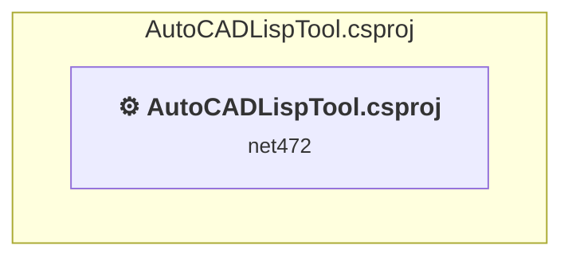

# Projects and dependencies analysis

This document provides a comprehensive overview of the projects and their dependencies in the context of upgrading to .NETCoreApp,Version=v8.0.

## Table of Contents

- [Executive Summary](#executive-Summary)
  - [Highlevel Metrics](#highlevel-metrics)
  - [Projects Compatibility](#projects-compatibility)
  - [Package Compatibility](#package-compatibility)
  - [API Compatibility](#api-compatibility)
  - [Binding Redirect Configuration](#binding-redirect-configuration)
- [Aggregate NuGet packages details](#aggregate-nuget-packages-details)
- [Top API Migration Challenges](#top-api-migration-challenges)
  - [Technologies and Features](#technologies-and-features)
  - [Most Frequent API Issues](#most-frequent-api-issues)
- [Projects Relationship Graph](#projects-relationship-graph)
- [Project Details](#project-details)

  - [AutoCADLispTool.csproj](#autocadlisptoolcsproj)

## Executive Summary

### Highlevel Metrics

| Metric | Count | Status |
| :--- | :---: | :--- |
| Total Projects | 1 | All require upgrade |
| Total NuGet Packages | 1 | All packages need upgrade |
| Total Code Files | 9 |  |
| Total Code Files with Incidents | 4 |  |
| Total Lines of Code | 1275 |  |
| Total Number of Issues | 612 |  |
| Estimated LOC to modify | 609+ | at least 47.8% of codebase |

### Projects Compatibility

| Project | Target Framework | Difficulty | Package Issues | API Issues | Binding Issues | Est. LOC Impact | Description |
| :--- | :---: | :---: | :---: | :---: | :---: | :---: | :--- |
| [AutoCADLispTool.csproj](#autocadlisptoolcsproj) | net472 | 🟡 Medium | 1 | 609 | 0 | 609+ | ClassicWinForms, Sdk Style = False |

### Package Compatibility

| Status | Count | Percentage |
| :--- | :---: | :---: |
| ✅ Compatible | 0 | 0.0% |
| ⚠️ Incompatible | 1 | 100.0% |
| 🔄 Upgrade Recommended | 0 | 0.0% |
| ***Total NuGet Packages*** | ***1*** | ***100%*** |

### API Compatibility

| Category | Count | Impact |
| :--- | :---: | :--- |
| 🔴 Binary Incompatible | 600 | High - Require code changes |
| 🟡 Source Incompatible | 9 | Medium - Needs re-compilation and potential conflicting API error fixing |
| 🔵 Behavioral change | 0 | Low - Behavioral changes that may require testing at runtime |
| ✅ Compatible | 1066 |  |
| ***Total APIs Analyzed*** | ***1675*** |  |

## Aggregate NuGet packages details

| Package | Current Version | Suggested Version | Projects | Description |
| :--- | :---: | :---: | :--- | :--- |
| AutoCAD.NET | 24.3.0 | 25.1.0 | [AutoCADLispTool.csproj](#autocadlisptoolcsproj) | ⚠️NuGet package is incompatible |

## Top API Migration Challenges

### Technologies and Features

| Technology | Issues | Percentage | Migration Path |
| :--- | :---: | :---: | :--- |
| Windows Forms | 600 | 98.5% | Windows Forms APIs for building Windows desktop applications with traditional Forms-based UI that are available in .NET on Windows. Enable Windows Desktop support: Option 1 (Recommended): Target net9.0-windows; Option 2: Add <UseWindowsDesktop>true</UseWindowsDesktop>; Option 3 (Legacy): Use Microsoft.NET.Sdk.WindowsDesktop SDK. |
| GDI+ / System.Drawing | 9 | 1.5% | System.Drawing APIs for 2D graphics, imaging, and printing that are available via NuGet package System.Drawing.Common. Note: Not recommended for server scenarios due to Windows dependencies; consider cross-platform alternatives like SkiaSharp or ImageSharp for new code. |

### Most Frequent API Issues

| API | Count | Percentage | Category |
| :--- | :---: | :---: | :--- |
| T:System.Windows.Forms.Button | 60 | 9.9% | Binary Incompatible |
| T:System.Windows.Forms.ListView | 36 | 5.9% | Binary Incompatible |
| T:System.Windows.Forms.TextBox | 32 | 5.3% | Binary Incompatible |
| T:System.Windows.Forms.Label | 26 | 4.3% | Binary Incompatible |
| T:System.Windows.Forms.DialogResult | 17 | 2.8% | Binary Incompatible |
| T:System.Windows.Forms.MessageBoxIcon | 16 | 2.6% | Binary Incompatible |
| T:System.Windows.Forms.MessageBoxButtons | 16 | 2.6% | Binary Incompatible |
| T:System.Windows.Forms.CheckBox | 16 | 2.6% | Binary Incompatible |
| T:System.Windows.Forms.ProgressBar | 13 | 2.1% | Binary Incompatible |
| P:System.Windows.Forms.TextBox.Text | 13 | 2.1% | Binary Incompatible |
| P:System.Windows.Forms.Control.Name | 13 | 2.1% | Binary Incompatible |
| T:System.Windows.Forms.Control.ControlCollection | 12 | 2.0% | Binary Incompatible |
| P:System.Windows.Forms.Control.Controls | 12 | 2.0% | Binary Incompatible |
| M:System.Windows.Forms.Control.ControlCollection.Add(System.Windows.Forms.Control) | 12 | 2.0% | Binary Incompatible |
| P:System.Windows.Forms.Control.TabIndex | 12 | 2.0% | Binary Incompatible |
| P:System.Windows.Forms.Control.Size | 12 | 2.0% | Binary Incompatible |
| P:System.Windows.Forms.Control.Location | 12 | 2.0% | Binary Incompatible |
| T:System.Windows.Forms.ListView.ListViewItemCollection | 10 | 1.6% | Binary Incompatible |
| P:System.Windows.Forms.ListView.Items | 10 | 1.6% | Binary Incompatible |
| F:System.Windows.Forms.MessageBoxButtons.OK | 8 | 1.3% | Binary Incompatible |
| T:System.Windows.Forms.MessageBox | 8 | 1.3% | Binary Incompatible |
| M:System.Windows.Forms.MessageBox.Show(System.String,System.String,System.Windows.Forms.MessageBoxButtons,System.Windows.Forms.MessageBoxIcon) | 8 | 1.3% | Binary Incompatible |
| P:System.Windows.Forms.Control.Enabled | 8 | 1.3% | Binary Incompatible |
| T:System.Windows.Forms.ListViewItem | 7 | 1.1% | Binary Incompatible |
| P:System.Windows.Forms.Label.Text | 6 | 1.0% | Binary Incompatible |
| T:System.Windows.Forms.ListViewItem.ListViewSubItemCollection | 6 | 1.0% | Binary Incompatible |
| P:System.Windows.Forms.ListViewItem.SubItems | 6 | 1.0% | Binary Incompatible |
| T:System.Windows.Forms.ListViewItem.ListViewSubItem | 6 | 1.0% | Binary Incompatible |
| T:System.Windows.Forms.View | 6 | 1.0% | Binary Incompatible |
| P:System.Windows.Forms.ButtonBase.UseVisualStyleBackColor | 6 | 1.0% | Binary Incompatible |
| P:System.Windows.Forms.ButtonBase.Text | 6 | 1.0% | Binary Incompatible |
| E:System.Windows.Forms.Control.Click | 5 | 0.8% | Binary Incompatible |
| M:System.Windows.Forms.Button.#ctor | 5 | 0.8% | Binary Incompatible |
| F:System.Windows.Forms.MessageBoxIcon.Error | 4 | 0.7% | Binary Incompatible |
| M:System.Windows.Forms.ListViewItem.ListViewSubItemCollection.Add(System.String) | 4 | 0.7% | Binary Incompatible |
| M:System.Windows.Forms.ListView.ListViewItemCollection.Clear | 3 | 0.5% | Binary Incompatible |
| P:System.Windows.Forms.Form.Text | 3 | 0.5% | Binary Incompatible |
| P:System.Windows.Forms.ProgressBar.Value | 3 | 0.5% | Binary Incompatible |
| F:System.Windows.Forms.DialogResult.OK | 3 | 0.5% | Binary Incompatible |
| M:System.Windows.Forms.CommonDialog.ShowDialog | 3 | 0.5% | Binary Incompatible |
| P:System.Windows.Forms.OpenFileDialog.Multiselect | 3 | 0.5% | Binary Incompatible |
| P:System.Windows.Forms.FileDialog.CheckPathExists | 3 | 0.5% | Binary Incompatible |
| P:System.Windows.Forms.OpenFileDialog.CheckFileExists | 3 | 0.5% | Binary Incompatible |
| P:System.Windows.Forms.FileDialog.Title | 3 | 0.5% | Binary Incompatible |
| P:System.Windows.Forms.FileDialog.FilterIndex | 3 | 0.5% | Binary Incompatible |
| P:System.Windows.Forms.FileDialog.Filter | 3 | 0.5% | Binary Incompatible |
| T:System.Windows.Forms.OpenFileDialog | 3 | 0.5% | Binary Incompatible |
| M:System.Windows.Forms.OpenFileDialog.#ctor | 3 | 0.5% | Binary Incompatible |
| P:System.Windows.Forms.ListView.ListViewItemCollection.Item(System.Int32) | 3 | 0.5% | Binary Incompatible |
| P:System.Windows.Forms.CheckBox.Checked | 3 | 0.5% | Binary Incompatible |

## Projects Relationship Graph

Legend:
📦 SDK-style project
⚙️ Classic project

## Project Details

### AutoCADLispTool.csproj

#### Project Info

- **Current Target Framework:** net472
- **Proposed Target Framework:** net8.0-windows
- **SDK-style**: False
- **Project Kind:** ClassicWinForms
- **Dependencies**: 0
- **Dependants**: 0
- **Number of Files**: 11
- **Number of Files with Incidents**: 4
- **Lines of Code**: 1275
- **Estimated LOC to modify**: 609+ (at least 47.8% of the project)

#### Dependency Graph

Legend:
📦 SDK-style project
⚙️ Classic project

### API Compatibility

| Category | Count | Impact |
| :--- | :---: | :--- |
| 🔴 Binary Incompatible | 600 | High - Require code changes |
| 🟡 Source Incompatible | 9 | Medium - Needs re-compilation and potential conflicting API error fixing |
| 🔵 Behavioral change | 0 | Low - Behavioral changes that may require testing at runtime |
| ✅ Compatible | 1066 |  |
| ***Total APIs Analyzed*** | ***1675*** |  |

#### Project Technologies and Features

| Technology | Issues | Percentage | Migration Path |
| :--- | :---: | :---: | :--- |
| GDI+ / System.Drawing | 9 | 1.5% | System.Drawing APIs for 2D graphics, imaging, and printing that are available via NuGet package System.Drawing.Common. Note: Not recommended for server scenarios due to Windows dependencies; consider cross-platform alternatives like SkiaSharp or ImageSharp for new code. |
| Windows Forms | 600 | 98.5% | Windows Forms APIs for building Windows desktop applications with traditional Forms-based UI that are available in .NET on Windows. Enable Windows Desktop support: Option 1 (Recommended): Target net9.0-windows; Option 2: Add <UseWindowsDesktop>true</UseWindowsDesktop>; Option 3 (Legacy): Use Microsoft.NET.Sdk.WindowsDesktop SDK. |

